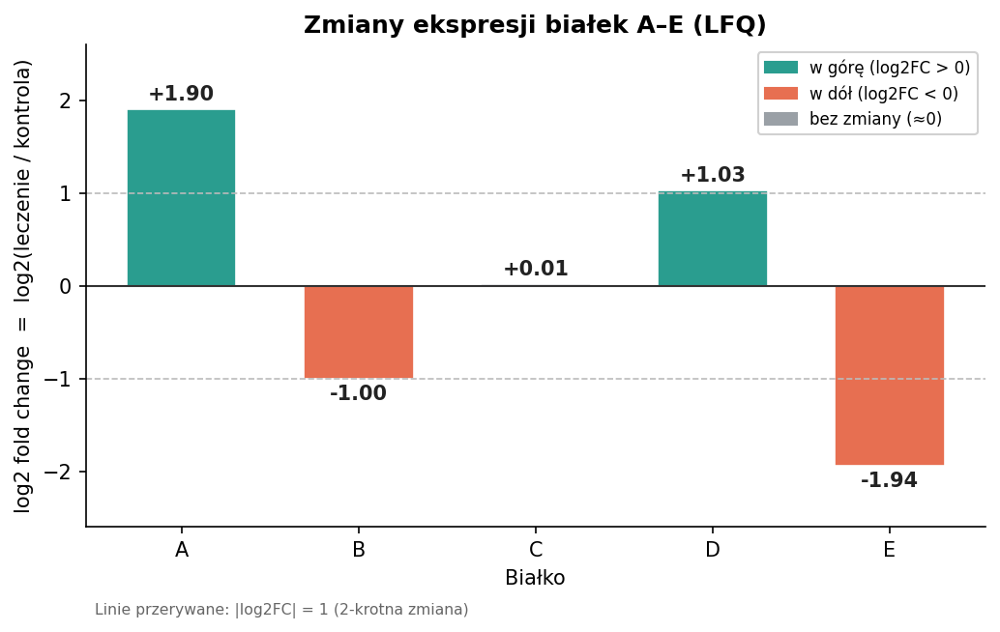

# Zadanie 9. Obliczenia LFQ i wykres zmian ekspresji

## Treść / cel

Oblicz średnią intensywność każdego białka w kontroli i po leczeniu, policz
log2 fold change, oznacz białka regulowane w górę/w dół i narysuj wykres słupkowy.

## Rozwiązanie

### Dane wejściowe

| Białko | Ctrl_1 | Ctrl_2 | Drug_1 | Drug_2 |
|---|---|---|---|---|
| A | 100 | 120 | 400 | 420 |
| B | 200 | 180 | 100 | 90 |
| C | 50 | 55 | 52 | 54 |
| D | 80 | 82 | 160 | 170 |
| E | 500 | 480 | 125 | 130 |

### Obliczenia (średnie, iloraz, log2FC)

Wzór: **log2FC = log₂(średnia leczenie / średnia kontrola)**

| Białko | Śr. kontrola | Śr. leczenie | Iloraz | log2FC | Klasyfikacja |
|---|---|---|---|---|---|
| A | 110.0 | 410.0 | 3.727 | **+1.898** | w górę |
| B | 190.0 | 95.0 | 0.500 | **−1.000** | w dół |
| C | 52.5 | 53.0 | 1.010 | **+0.014** | bez zmiany |
| D | 81.0 | 165.0 | 2.037 | **+1.026** | w górę |
| E | 490.0 | 127.5 | 0.260 | **−1.942** | w dół |

### Klasyfikacja (punkt 17)

- **w górę (log2FC > 0):** A (~3,7×), D (~2×)
- **w dół (log2FC < 0):** B (spadek do połowy), E (~3,8× spadek)
- **bez zmiany (log2FC ≈ 0):** C (+0,014 — praktycznie brak zmiany)

### Wykres słupkowy (punkt 18)

Wykres pokazuje log2FC dla każdego białka; linie przerywane oznaczają |log2FC| = 1
(dwukrotna zmiana). Kolor zielony = wzrost, pomarańczowy = spadek, szary = brak zmiany.

## Wniosek

Lek najsilniej zwiększa poziom białka A i podnosi D, a obniża E i B; białko C pozostaje
niezmienione. Interpretacja obserwacyjna — w rzeczywistym eksperymencie fold change należy
oceniać łącznie z istotnością statystyczną (por. Zadanie 8).
