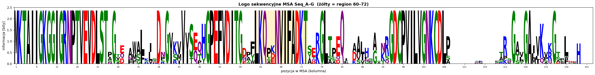

# Zadanie 19. Logo sekwencyjne

## Treść / cel

Wygenerować logo z MSA (WebLogo) i przeanalizować region ~60–70: wskazać najwyższe litery
i wyjaśnić ich znaczenie dla konserwacji ewolucyjnej.

## Rozwiązanie

Logo policzone z rzeczywistego MSA (7 sekwencji). Wysokość słupka = zawartość informacji
(bity); pełna konserwacja przy 7 sekwencjach ≈ 2,3 bita po korekcji małej próby.

### Region ~60–70 (zaznaczony na żółto)

Najwyższe (pełnej wysokości, ~2,3 bita) litery w tym oknie to motyw:

- **L60, K61, Q62** — a po dwóch zmiennych kolumnach (63–64) —
- **N65, V66, I67, F68, A69, D70, K71, T72**  → motyw **`NVIFADKT`**

Czyli w oknie 60–70 dominuje konserwowany blok **`LKQ … NVIFADKT`**. Kolumny 63–64 (P/K)
są niskie i wielokolorowe (zmienność). Bezpośrednio przed oknem (kol. ~53–56) leży również
konserwowany motyw **`DITG`**.

### Znaczenie wysokości liter

- **Wysoka, pojedyncza litera** = ten sam aminokwas we (niemal) wszystkich sekwencjach →
  wysoka informacja i silna presja selekcyjna (reszta ważna strukturalnie/funkcjonalnie).
- **Niski, wielokolorowy stos** = wiele różnych aminokwasów → zmienność, brak presji.

Motyw `NVIFADKT` jest w pełni konserwowany we wszystkich 7 sekwencjach, więc to prawdopodobnie
element rdzenia wiążącego nukleotyd/kofaktor (razem z blokami z Zad. 17).

### Potwierdzenie z Zadania 17

Logo potwierdza wynik MSA: **wysokie stosy** w blokach rdzenia (kol. 1–23, 47–56, 60–72, 93–106)
i **niskie/rozproszone** w regionie insercyjnym (kol. ~108–120).

> Uwaga: dokładna numeracja kolumn zależy od luk wstawionych przez narzędzie MSA —
> jeśli w Twoim MAFFT motyw `NVIFADKT` wypadnie np. na 62–69, opisz zakres zgodny z własnym logo.
